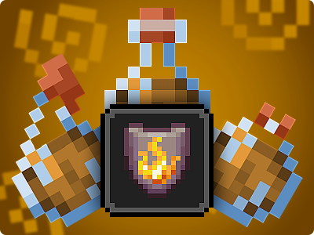

# PermissionEffects

> Give players potion effects based on their permissions  
> Per world customization 
> You can add/edit or remove effects on [config.json](resources/config.json)

> Global permission: permissionEffects.* 

# [Push your ideas here](https://github.com/ImAMadDev/PermissionEffects/issues/new)
